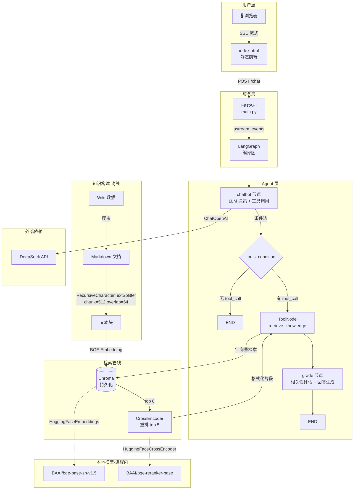
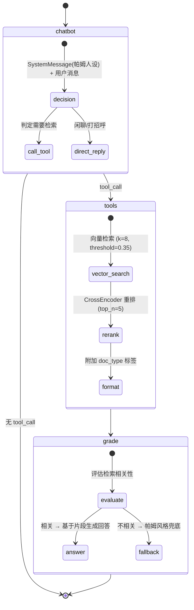

# 崩坏:星穹铁道 助手——帕姆帮帮

> **V1.1** — 修复回答重复输出的问题；Chroma 知识库内嵌进项目。

> **V1** — 崩铁的帕姆帮帮测试结束了，但还是想试试？对此，基于 Agentic RAG 的崩坏:星穹铁道角色知识助手，列车长帕姆为你解答一切。暂时只支持游戏相关术语和全部角色的各个信息
## 架构总览

### 系统架构



### LangGraph 工作流



## 技术选型

| 组件 | 选型 | 说明 |
|------|------|------|
| Agent 框架 | LangGraph | 显式状态图、条件分支可控、便于调试和白板讲解 |
| 向量数据库 | Chroma (持久化模式) | 嵌入式运行、无需独立服务、支持元数据过滤、与 LangChain 深度集成 |
| Embedding | BAAI/bge-base-zh-v1.5 | 中文语义理解优秀、本地部署零成本、C-MTEB 排名领先 |
| 重排序 | CrossEncoder (bge-reranker-base) | 对 top 8 向量结果二次精排到 top 5，提升检索精度 |
| 大模型 | DeepSeek | 中文能力强、成本低、支持 function calling |
| 文档解析 | UnstructuredMarkdownLoader | 保留 Markdown 结构信息，按语义边界切分更准确 |
| 前后端通信 | SSE 流式 | 单向推送场景更轻量，FastAPI 原生支持 |

## 项目结构

```
pamu_assist/
├── main.py                      # FastAPI 入口，SSE 流式接口
├── src/
│   ├── graph/
│   │   └── Agentic_RAG.py       # LangGraph 三节点工作流定义
│   ├── models/
│   │   ├── llm.py               # DeepSeek 大模型实例
│   │   └── chroma.py            # Chroma 持久化向量库 + BGE Embedding
│   ├── tools/
│   │   └── rag_tool.py          # 检索工具：向量检索 + CrossEncoder 重排
│   ├── prompts/
│   │   ├── decision_prompt.py   # chatbot 节点 System Prompt（帕姆人设）
│   │   └── grade_prompt.py      # grade 节点 Prompt（评估 + 生成）
│   ├── data_loader/
│   │   ├── document_loader.py   # Markdown 文档加载
│   │   ├── document_splitter.py # 递归文本分割 (chunk=512, overlap=64)
│   │   ├── document_index.py    # 向量入库（哈希去重、增量更新）
│   │   ├── data_ingestion.py    # 入库主入口
│   │   └── term_loader.py       # 术语表解析加载
│   ├── util/
│   │   └── config.py            # .env 配置加载
│   └── static/
│       └── index.html           # 前端聊天界面
├── data/
│   └── json/                    # Wiki 原始 JSON 数据
├── chroma_data/                 # Chroma 持久化向量库
└── crawler/
    └── json_to_md.py            # Wiki JSON → Markdown 转换
```

## 快速开始

### 环境要求

- Python 3.10+
- DeepSeek API Key

### 安装

```bash
# 1. 克隆项目
git clone <repo-url>
cd pamu_assist

# 2. 安装依赖
pip install -r requirements.txt

# 3. 配置环境变量
cp .env.example .env
# 编辑 .env 填入 DEEPSEEK_API_KEY 等配置

# 4. 生成智库
cd crawler
python json_to_md.py

# 5. 入库知识数据
cd ../src/data_loader
python data_ingestion.py

# 6. 启动服务
cd ../..
python main.py
# 访问 http://localhost:426/static/index.html
```

## 检索管线

```
用户问题 → LLM 解析角色名 + 查询方面
                ↓
        Chroma 向量检索 (cosine, k=8, threshold≥0.35)
                ↓
        CrossEncoder 重排序 (bge-reranker-base, top_n=5)
                ↓
        附加 doc_type 标签 ([角色数据] / [术语 XX相关])
                ↓
        LLM 评估相关性 + 生成帕姆风格回答
```

- 相似度阈值 0.35 过滤明显无关内容
- CrossEncoder Top 8 → Top 5，平衡召回率与精度
- `doc_type` 标签区分角色专属机制与游戏通用规则，避免幻觉

## 效果展示
### 界面展示

### 示例1

### 示例2
